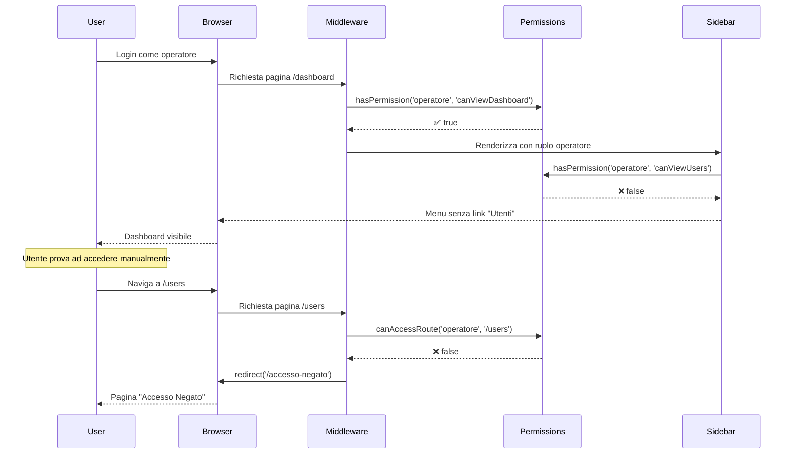

# 🔐 Sistema di Permessi Basato su Ruoli (RBAC)

**Data**: 2026-01-12
**Versione**: 1.0
**Status**: ✅ Implementato

---

## 🎯 Panoramica

Il sistema implementa un **Role-Based Access Control (RBAC)** con 3 livelli di ruolo:

1. **Operatore** - Accesso base (visualizza e gestisce clienti)
2. **Admin** - Accesso completo (gestisce utenti, settings, audit logs)
3. **Superuser** - Accesso totale (può creare altri superuser)

---

## 📋 Ruoli e Permessi

### 🔵 OPERATORE

**Cosa può fare**:
- ✅ Visualizzare dashboard
- ✅ Visualizzare clienti
- ✅ Creare clienti
- ✅ Modificare clienti
- ❌ **NON può** eliminare clienti
- ❌ **NON può** vedere utenti
- ❌ **NON può** gestire settings
- ❌ **NON può** vedere audit logs

**Menu visibile**:
- Dashboard
- Clienti

### 🟢 ADMIN

**Cosa può fare**:
- ✅ Tutto quello che può fare l'operatore
- ✅ Eliminare clienti
- ✅ **Visualizzare utenti**
- ✅ Creare/modificare/eliminare utenti
- ✅ Visualizzare audit logs
- ❌ **NON può** creare altri superuser
- ❌ **NON può** accedere alle configurazioni (solo superuser)

**Menu visibile**:
- **Menu principale**: Dashboard, Clienti
- **Menu profilo**: Il Mio Profilo, **Utenti**

### 🟣 SUPERUSER

**Cosa può fare**:
- ✅ Tutto quello che può fare l'admin
- ✅ **Creare altri superuser**
- ✅ Accesso illimitato a tutte le funzionalità

**Menu visibile**:
- **Menu principale**: Dashboard, Clienti
- **Menu profilo**: Il Mio Profilo, Utenti, SMTP, Agenti AI

---

## 🏗️ Architettura

### 1. File Helper Permessi

**File**: [shared/utils/permissions.ts](../../shared/utils/permissions.ts)

```typescript
// Definizione ruoli
export const ROLES = {
  OPERATORE: 'operatore',
  ADMIN: 'admin',
  SUPERUSER: 'superuser'
} as const;

// Mappa permessi per ruolo
export const PERMISSIONS = {
  [ROLES.OPERATORE]: {
    canViewDashboard: true,
    canViewClienti: true,
    canViewUsers: false,      // ❌
    // ...
  },
  [ROLES.ADMIN]: {
    canViewDashboard: true,
    canViewClienti: true,
    canViewUsers: true,       // ✅
    // ...
  },
  // ...
};

// Helper functions
export function hasPermission(userRole, permission): boolean
export function isAdmin(userRole): boolean
export function canAccessRoute(userRole, path): boolean
```

### 2. Sidebar Dinamica (Menu Principale)

**File**: [src/components/Sidebar.astro](../../src/components/Sidebar.astro)

```typescript
const user = Astro.locals.user;
const userRole = user?.ruolo;

const allNavItems = [
  { href: '/dashboard', label: 'Dashboard', permission: 'canViewDashboard' },
  { href: '/anagrafica-clienti', label: 'Clienti', permission: 'canViewClienti' }
];

// Filtra in base ai permessi
const navItems = allNavItems.filter(item =>
  hasPermission(userRole, item.permission)
);
```

### 3. Sidebar Profilo (Menu Profilo)

**File**: [src/components/SidebarProfile.astro](../../src/components/SidebarProfile.astro)

```typescript
const user = Astro.locals.user;
const userRole = user?.ruolo;

const profileItems = [
  { href: '/profile', label: 'Il Mio Profilo', visible: true },
  { href: '/users', label: 'Utenti', visible: hasPermission(userRole, 'canViewUsers') },
  { href: '/settings-smtp', label: 'SMTP', visible: hasPermission(userRole, 'canViewSettings') },
  { href: '/settings-ai', label: 'Agenti AI', visible: hasPermission(userRole, 'canViewSettings') }
];
```

### 4. Middleware Protezione Rotte

**File**: [src/middleware/index.ts](../../src/middleware/index.ts)

```typescript
// 🔒 CONTROLLO PERMESSI dopo autenticazione
if (!canAccessRoute(userRole, url.pathname)) {
  console.log(`Accesso negato: ruolo "${userRole}" non può accedere a "${url.pathname}"`);
  return redirect('/accesso-negato');  // ← Pagina dedicata
}
```

### 5. Pagina Accesso Negato

**File**: [src/pages/accesso-negato.astro](../../src/pages/accesso-negato.astro)

Pagina dedicata mostrata quando un utente tenta di accedere a una risorsa senza permessi:
- ✅ Design chiaro e professionale
- ✅ Icona shield con X rossa
- ✅ Messaggio esplicativo
- ✅ Pulsanti: "Torna alla Dashboard" e "Indietro"
- ✅ Box informativo con suggerimenti

**Rotte protette (middleware)**:
```typescript
export const PROTECTED_ROUTES = {
  '/users': 'canViewUsers',           // Solo admin/superuser
  '/audit-logs': 'canViewAuditLogs'   // Solo admin/superuser
};
```

**Rotte protette (page-level)**:
- `/settings-smtp` e `/settings-ai` fanno redirect a `/accesso-negato` se non autorizzato.

---

## 🧪 Come Testare

### Test 1: Operatore non vede link "Utenti"

1. **Setup**: Imposta utente come operatore
   ```bash
   # .env.local
   DEV_USER_ROLE=operatore
   ```

2. **Restart dev server**:
   ```bash
   npm run dev
   ```

3. **Verifica**:
   - Login all'app
   - Controlla sidebar principale
   - ✅ Vedi: Dashboard, Clienti
   - ❌ **NON vedi**: Utenti

### Test 2: Operatore non può accedere a /users

1. **Setup**: Stesso setup Test 1 (operatore)

2. **Azione**: Prova ad accedere manualmente a `/users`
   - Scrivi nella barra URL: `http://localhost:4321/users`

3. **Verifica**:
   - ✅ Vieni reindirizzato a `/accesso-negato`
   - ✅ Vedi pagina "Accesso Negato" con design professionale
   - ✅ Console mostra: `[MIDDLEWARE DEV] Accesso negato: utente con ruolo "operatore" non può accedere a "/users"`
   - ✅ Puoi cliccare "Torna alla Dashboard" o "Indietro"

### Test 3: Admin vede link "Utenti" nel menu profilo

1. **Setup**: Imposta utente come admin
   ```bash
   # .env.local
   DEV_USER_ROLE=admin
   ```

2. **Restart dev server**

3. **Verifica**:
   - Login all'app
   - Vai su `/profile`
   - ✅ Vedi: Il Mio Profilo, **Utenti**

### Test 4: Admin può accedere a /users

1. **Setup**: Stesso setup Test 3 (admin)

2. **Azione**: Clicca su "Utenti" nel menu profilo

3. **Verifica**:
   - ✅ Accedi alla pagina `/users`
   - ✅ Nessun redirect
   - ✅ Vedi lista utenti (se la pagina esiste)

---

## 🔄 Flusso Completo

### Scenario: Operatore prova ad accedere a /users



---

## 📁 File Modificati

### 1. [shared/utils/permissions.ts](../../shared/utils/permissions.ts) (NUOVO)
- Definizione ruoli e permessi
- Helper functions: `hasPermission()`, `isAdmin()`, `canAccessRoute()`
- Mappa rotte protette

### 2. [src/components/Sidebar.astro](../../src/components/Sidebar.astro) (MODIFICATO)
- Import `hasPermission()`
- Lettura ruolo da `Astro.locals.user`
- Filtro voci menu in base a permessi
- Menu principale contiene solo Dashboard/Clienti

### 3. [src/components/SidebarProfile.astro](../../src/components/SidebarProfile.astro) (MODIFICATO)
- Menu profilo con Utenti/SMTP/Agenti AI in base ai permessi

### 4. [src/middleware/index.ts](../../src/middleware/index.ts) (MODIFICATO)
- Import `canAccessRoute()`
- Controllo permessi dopo autenticazione
- Redirect a `/accesso-negato` se accesso negato
- Aggiunto `/accesso-negato` ai path pubblici
- Implementato sia per DEV che PROD

### 5. [src/pages/accesso-negato.astro](../../src/pages/accesso-negato.astro) (NUOVO)
- Pagina dedicata per accesso negato
- Design professionale con animazioni
- Icona shield con X rossa
- Pulsanti "Torna alla Dashboard" e "Indietro"
- Box informativo con suggerimenti utili
- Responsive mobile-friendly

---

## 🚀 Estendere il Sistema

### Aggiungere Nuova Rotta Protetta

**Esempio**: Proteggere `/reports` con middleware

1. **Aggiungi permesso in permissions.ts**:
```typescript
export const PROTECTED_ROUTES = {
  '/users': 'canViewUsers',
  '/reports': 'canViewReports'
};
```

2. **Aggiungi link nel menu** (Sidebar.astro o SidebarProfile.astro)

3. **Fatto!** Il middleware protegge automaticamente la rotta

### Aggiungere Nuovo Ruolo

**Esempio**: Aggiungere ruolo "Manager"

1. **Definisci ruolo** (permissions.ts):
```typescript
export const ROLES = {
  OPERATORE: 'operatore',
  MANAGER: 'manager',     // ← Nuovo
  ADMIN: 'admin',
  SUPERUSER: 'superuser'
};
```

2. **Definisci permessi**:
```typescript
export const PERMISSIONS = {
  // ...
  [ROLES.MANAGER]: {
    canViewDashboard: true,
    canViewClienti: true,
    canDeleteClienti: true,  // Manager può eliminare
    canViewUsers: false,
    // ...
  }
};
```

3. **Aggiorna schema Zod** (zodSchemas.ts):
```typescript
ruolo: z.union([
  z.literal('operatore'),
  z.literal('manager'),    // ← Nuovo
  z.literal('admin'),
  z.literal('superuser')
])
```

---

## 🛡️ Controlli di Sicurezza

### Livello 1: UI (Sidebar)
- ✅ Nasconde link non accessibili
- ⚠️ **Non è sicurezza** - solo UX
- 🔓 Utente tecnico può ancora navigare manualmente

### Livello 2: Middleware
- ✅ **Vera sicurezza server-side**
- ✅ Blocca accesso a rotte protette
- ✅ Redirect automatico se accesso negato

### Livello 3: API
- ✅ Backend verifica permessi con `requireAdmin()`
- ✅ Firebase Rules proteggono Firestore
- ✅ Defense in Depth completo

---

## 📊 Matrice Permessi

| Azione | Operatore | Admin | Superuser |
|--------|-----------|-------|-----------|
| View Dashboard | ✅ | ✅ | ✅ |
| View Clienti | ✅ | ✅ | ✅ |
| Create Cliente | ✅ | ✅ | ✅ |
| Update Cliente | ✅ | ✅ | ✅ |
| Delete Cliente | ❌ | ✅ | ✅ |
| **View Utenti** | **❌** | **✅** | **✅** |
| Create Utente | ❌ | ✅ | ✅ |
| Update Utente | ❌ | ✅ | ✅ |
| Delete Utente | ❌ | ✅ | ✅ |
| View Settings | ❌ | ❌ | ✅ |
| Update Settings | ❌ | ❌ | ✅ |
| View Audit Logs | ❌ | ✅ | ✅ |
| Manage Superusers | ❌ | ❌ | ✅ |

---

## 🧪 Checklist Test Completa

### Test Operatore
- [ ] Login come operatore
- [ ] Verifica menu mostra solo: Dashboard, Clienti
- [ ] Verifica menu NON mostra: Utenti
- [ ] Prova navigare a `/users` → redirect a `/accesso-negato`
- [ ] Verifica console mostra "Accesso negato"
- [ ] Verifica può creare/modificare clienti
- [ ] Verifica NON può eliminare clienti (API restituisce 403)

### Test Admin
- [ ] Login come admin
- [ ] Verifica menu principale mostra: Dashboard, Clienti
- [ ] Verifica menu profilo mostra: Il Mio Profilo, Utenti
- [ ] Click su "Utenti" (menu profilo) → accesso OK
- [ ] Verifica può vedere lista utenti
- [ ] Verifica può creare/modificare/eliminare clienti
- [ ] Verifica può gestire utenti

### Test Superuser
- [ ] Login come superuser
- [ ] Verifica menu profilo mostra: Utenti, SMTP, Agenti AI
- [ ] Verifica può accedere a `/settings-smtp` e `/settings-ai`
- [ ] Verifica può creare altri superuser

---

## 🔗 File Correlati

- **Permissions Helper**: [shared/utils/permissions.ts](../../shared/utils/permissions.ts)
- **Sidebar**: [src/components/Sidebar.astro](../../src/components/Sidebar.astro)
- **Middleware**: [src/middleware/index.ts](../../src/middleware/index.ts)
- **Auth Helpers**: [functions/utils/authHelpers.ts](../../functions/utils/authHelpers.ts)

---

**Data ultimo aggiornamento**: 2026-01-12
**Revisione**: v1.0
**Status**: Implementato e testato ✅
