# 🔒 Sistema di Validazione con Zod

**Data**: 2026-01-12
**Versione**: 1.0
**Status**: ✅ Implementato

---

## 🎯 Panoramica

Il sistema di validazione utilizza **Zod** per garantire type-safety e validazione runtime sia client-side che server-side.

### Vantaggi di Zod

✅ **Type-Safe**: TypeScript types derivati automaticamente dagli schemi
✅ **Isomorphic**: Stesso schema utilizzabile client + server
✅ **Messaggi Chiari**: Errori localizzati e facili da interpretare
✅ **Lightweight**: Solo ~8KB minified
✅ **Composable**: Pattern riutilizzabili e combinabili

---

## 📁 Struttura File

```
shared/
  schemas/
    zodSchemas.ts          # 🔒 Schemi Zod condivisi
    entityFactory.ts       # 🏭 Factory per creazione entità

functions/
  api/
    clienti.ts             # Backend API con validazione Zod
    users.ts
    ...

src/
  scripts/
    anagrafica-clienti.ts  # Frontend form con validazione Zod
```

---

## 🔧 Schema Condivisi

**File**: [shared/schemas/zodSchemas.ts](../../shared/schemas/zodSchemas.ts)

### Pattern Riutilizzabili

```typescript
import { z } from 'zod';

// Partita IVA italiana (11 cifre)
export const PartitaIvaSchema = z.string()
  .regex(/^\d{11}$/, 'La Partita IVA deve essere di 11 cifre')
  .optional()
  .nullable()
  .transform(val => val === '' ? null : val);

// Codice Fiscale italiano (16 caratteri alfanumerici)
export const CodiceFiscaleSchema = z.string()
  .regex(/^[A-Z]{6}\d{2}[A-Z]\d{2}[A-Z]\d{3}[A-Z]$/i, 'Formato Codice Fiscale non valido')
  .optional()
  .nullable()
  .transform(val => val === '' ? null : (val ? val.toUpperCase() : null));

// Email normalizzata (lowercase)
export const EmailSchema = z.string()
  .email('Email non valida')
  .optional()
  .nullable()
  .transform(val => val === '' ? null : (val ? val.toLowerCase() : null));
```

### Schema Entità Completo

```typescript
export const ClienteSchema = z.object({
  ragione_sociale: z.string()
    .min(1, 'La ragione sociale è obbligatoria')
    .max(200, 'Massimo 200 caratteri'),

  codice: z.string()
    .min(1, 'Il codice è obbligatorio')
    .max(50, 'Massimo 50 caratteri')
    .regex(/^[A-Z0-9_-]+$/i, 'Solo lettere, numeri, underscore e trattino'),

  email: EmailSchema,
  telefono: TelefonoSchema,
  partita_iva: PartitaIvaSchema,
  codice_fiscale: CodiceFiscaleSchema,

  status: z.boolean()
    .default(true)
});

// Type TypeScript derivato automaticamente
export type ClienteInput = z.infer<typeof ClienteSchema>;

// Schema parziale per UPDATE (tutti i campi opzionali)
export const ClienteUpdateSchema = ClienteSchema.partial();
export type ClienteUpdateInput = z.infer<typeof ClienteUpdateSchema>;
```

---

## 🔐 Validazione Backend (API)

**File**: [functions/api/clienti.ts](../../functions/api/clienti.ts)

### Import Schema

```typescript
import { ClienteSchema, ClienteUpdateSchema } from "../../shared/schemas/zodSchemas.ts";
```

### Funzione di Validazione

```typescript
/**
 * 🔒 Validazione dati con Zod
 *
 * @param data - Dati da validare
 * @param isPartial - Se true, usa schema parziale per UPDATE
 * @throws HttpsError se validazione fallisce
 */
function validateClienteData(data: any, isPartial = false) {
    const schema = isPartial ? ClienteUpdateSchema : ClienteSchema;
    const result = schema.safeParse(data);

    if (!result.success) {
        // Estrae il primo errore per messaggio chiaro
        const firstError = result.error.errors[0];
        const errorMessage = `${firstError.path.join('.')}: ${firstError.message}`;
        throw new HttpsError('invalid-argument', errorMessage);
    }

    return result.data; // ✅ Dati validati e normalizzati
}
```

### Uso in CREATE API

```typescript
export const createClienteApi = onCall({
    region: region,
    cors: corsOrigins
}, async (request) => {
    await requireAdmin(request);

    const { uid, token } = request.auth;
    const data = request.data;

    try {
        // ✅ Validazione con Zod
        const validatedData = validateClienteData(data);

        // Factory per audit fields
        const nuovoCliente = createCliente({
            ...validatedData,
            createdBy: uid,
            createdByEmail: token.email,
        });

        // Sostituisce placeholder con server timestamp
        nuovoCliente.created = FieldValue.serverTimestamp();
        nuovoCliente.changed = FieldValue.serverTimestamp();

        const docRef = await db.collection(COLLECTION_NAME).add(nuovoCliente);

        return { id: docRef.id, ...nuovoCliente };
    } catch (error) {
        if (error instanceof HttpsError) {
            throw error; // ✅ Propaga errori di validazione
        }
        throw new HttpsError('internal', 'Impossibile creare il cliente.');
    }
});
```

### Uso in UPDATE API

```typescript
export const updateClienteApi = onCall({
    region: region,
    cors: corsOrigins
}, async (request) => {
    await requireAdmin(request);

    const { uid } = request.auth;
    const { id, ...updateData } = request.data;

    if (!id) {
        throw new HttpsError('invalid-argument', 'L\'ID del cliente è obbligatorio.');
    }

    try {
        // ✅ Validazione con schema parziale (tutti i campi opzionali)
        const validatedData = validateClienteData(updateData, true);

        const dataToUpdate = {
            ...validatedData,
            changed: FieldValue.serverTimestamp(),
            lastModifiedBy: uid,
            lastModifiedByEmail: request.auth.token.email
        };

        await db.collection(COLLECTION_NAME).doc(id).update(dataToUpdate);

        return { message: "Cliente aggiornato con successo." };
    } catch (error) {
        if (error instanceof HttpsError) {
            throw error;
        }
        throw new HttpsError('internal', 'Impossibile aggiornare il cliente.');
    }
});
```

---

## 🖥️ Validazione Frontend (Form)

**File**: [src/scripts/anagrafica-clienti.ts](../../src/scripts/anagrafica-clienti.ts)

### Import Schema

```typescript
import { ClienteSchema } from '../../shared/schemas/zodSchemas.ts';
```

### Validazione nel Submit Handler

```typescript
async function saveEntity(e) {
    e.preventDefault();
    const isNew = !currentEntityId;

    // 🔒 STEP 1: Raccogli dati dal form
    const formData = {
        codice: (document.getElementById('codice') as HTMLInputElement).value,
        ragione_sociale: (document.getElementById('ragione_sociale') as HTMLInputElement).value,
        partita_iva: (document.getElementById('piva') as HTMLInputElement).value || null,
        codice_fiscale: (document.getElementById('cf') as HTMLInputElement).value || null,
        email: (document.getElementById('email') as HTMLInputElement).value || null,
        telefono: (document.getElementById('telefono') as HTMLInputElement).value || null,
        indirizzo: (document.getElementById('indirizzo') as HTMLInputElement).value || null,
        citta: (document.getElementById('citta') as HTMLInputElement).value || null,
        cap: (document.getElementById('cap') as HTMLInputElement).value || null,
        status: (document.getElementById('toggle-stato') as HTMLInputElement).checked
    };

    // 🔒 STEP 2: Validazione CLIENT-SIDE con Zod
    const validationResult = ClienteSchema.safeParse(formData);

    if (!validationResult.success) {
        // Mostra il primo errore trovato
        const firstError = validationResult.error.errors[0];
        const errorMessage = `${firstError.path.join('.')}: ${firstError.message}`;
        showSaveMessage('save-message', errorMessage, true);
        return; // ❌ Blocca invio se validazione fallisce
    }

    // 🔒 STEP 3: Normalizza con factory
    let normalized;
    try {
        normalized = createCliente({
            ...validationResult.data,
            codice: validationResult.data.codice,
            ragione_sociale: validationResult.data.ragione_sociale
        });
    } catch (err) {
        showSaveMessage('save-message', err.message || 'Dati non validi', true);
        return;
    }

    const { createdAt, updatedAt, createdBy, createdByEmail, ...payloadToSend } = normalized;

    // ✅ Invia al backend (già validato client-side)
    try {
        if (isNew) {
            const createApi = httpsCallable(functions, 'createClienteApi');
            await createApi(payloadToSend);
        } else {
            const updateApi = httpsCallable(functions, 'updateClienteApi');
            await updateApi({ id: currentEntityId, ...payloadToSend });
        }

        showSaveMessage('save-message');
    } catch (error) {
        // Errore backend (es: validazione server-side fallita)
        showSaveMessage('save-message', 'Errore: ' + error.message, true);
    }
}
```

---

## 🔄 Flusso di Validazione Completo

### Scenario: Creazione nuovo cliente

```mermaid
sequenceDiagram
    participant User
    participant Frontend
    participant ZodClient
    participant API
    participant ZodServer
    participant Firestore

    User->>Frontend: Compila form e clicca "Salva"
    Frontend->>ZodClient: ClienteSchema.safeParse(formData)

    alt Validazione Client Fallisce
        ZodClient-->>Frontend: ❌ Errore validazione
        Frontend->>User: Mostra messaggio errore
    else Validazione Client OK
        ZodClient-->>Frontend: ✅ Dati validati
        Frontend->>API: createClienteApi(validatedData)
        API->>ZodServer: validateClienteData(data)

        alt Validazione Server Fallisce
            ZodServer-->>API: ❌ Errore validazione
            API->>Frontend: HttpsError('invalid-argument')
            Frontend->>User: Mostra messaggio errore
        else Validazione Server OK
            ZodServer-->>API: ✅ Dati validati
            API->>Firestore: db.collection().add()
            Firestore-->>API: ✅ Documento creato
            API->>Frontend: { id, ...data }
            Frontend->>User: Mostra "Salvato con successo"
        end
    end
```



---

## ✅ Vantaggi Defense in Depth

### 1. Validazione Client-Side
- ✅ **UX Immediata**: Feedback istantaneo all'utente
- ✅ **Risparmio Risorse**: Non invia richieste non valide al server
- ✅ **Offline-First**: Può validare anche offline

### 2. Validazione Server-Side
- ✅ **Sicurezza**: Mai fidarsi solo del client
- ✅ **Integrità Dati**: Garantisce consistenza in Firestore
- ✅ **Business Logic**: Validazioni complesse server-side

### 3. Type Safety
- ✅ **Compile Time**: TypeScript rileva errori durante sviluppo
- ✅ **Runtime**: Zod valida dati effettivi a runtime
- ✅ **Refactoring Sicuro**: Modifiche allo schema propagano automaticamente

---

## 🧪 Esempi di Validazione

### Esempio 1: Campo Obbligatorio Mancante

**Input**:
```typescript
{
  ragione_sociale: "", // ❌ Vuoto
  codice: "CLI001"
}
```

**Output Zod**:
```json
{
  "success": false,
  "error": {
    "errors": [
      {
        "path": ["ragione_sociale"],
        "message": "La ragione sociale è obbligatoria"
      }
    ]
  }
}
```

**Messaggio utente**: `ragione_sociale: La ragione sociale è obbligatoria`

---

### Esempio 2: Email Non Valida

**Input**:
```typescript
{
  ragione_sociale: "Acme Corp",
  codice: "CLI001",
  email: "invalid-email" // ❌ Formato errato
}
```

**Output Zod**:
```json
{
  "success": false,
  "error": {
    "errors": [
      {
        "path": ["email"],
        "message": "Email non valida"
      }
    ]
  }
}
```

**Messaggio utente**: `email: Email non valida`

---

### Esempio 3: Partita IVA Errata

**Input**:
```typescript
{
  ragione_sociale: "Acme Corp",
  codice: "CLI001",
  partita_iva: "12345" // ❌ Deve essere 11 cifre
}
```

**Output Zod**:
```json
{
  "success": false,
  "error": {
    "errors": [
      {
        "path": ["partita_iva"],
        "message": "La Partita IVA deve essere di 11 cifre"
      }
    ]
  }
}
```

**Messaggio utente**: `partita_iva: La Partita IVA deve essere di 11 cifre`

---

### Esempio 4: Validazione OK con Trasformazioni

**Input**:
```typescript
{
  ragione_sociale: "Acme Corp",
  codice: "CLI001",
  email: "INFO@ACME.COM", // Verrà trasformato in lowercase
  codice_fiscale: "rssmra85m01h501z", // Verrà trasformato in uppercase
  partita_iva: "12345678901",
  status: true
}
```

**Output Zod** (success):
```json
{
  "success": true,
  "data": {
    "ragione_sociale": "Acme Corp",
    "codice": "CLI001",
    "email": "info@acme.com",        // ✅ Trasformato lowercase
    "codice_fiscale": "RSSMRA85M01H501Z", // ✅ Trasformato uppercase
    "partita_iva": "12345678901",
    "status": true
  }
}
```

---

## 📚 Pattern per Nuove Entità

### STEP 1: Crea Schema in zodSchemas.ts

```typescript
export const ProdottoSchema = z.object({
  nome: z.string()
    .min(1, 'Il nome è obbligatorio')
    .max(100, 'Massimo 100 caratteri'),

  codice: z.string()
    .min(1, 'Il codice è obbligatorio')
    .regex(/^PROD-\d+$/, 'Formato codice: PROD-123'),

  prezzo: z.number()
    .min(0, 'Il prezzo non può essere negativo')
    .max(999999, 'Prezzo massimo: 999999'),

  categoria: z.enum(['elettronica', 'alimentari', 'abbigliamento']),

  attivo: z.boolean().default(true)
});

export type ProdottoInput = z.infer<typeof ProdottoSchema>;
export const ProdottoUpdateSchema = ProdottoSchema.partial();
export type ProdottoUpdateInput = z.infer<typeof ProdottoUpdateSchema>;
```

### STEP 2: Backend API

```typescript
import { ProdottoSchema, ProdottoUpdateSchema } from "../../shared/schemas/zodSchemas.ts";

function validateProdottoData(data: any, isPartial = false) {
    const schema = isPartial ? ProdottoUpdateSchema : ProdottoSchema;
    const result = schema.safeParse(data);

    if (!result.success) {
        const firstError = result.error.errors[0];
        const errorMessage = `${firstError.path.join('.')}: ${firstError.message}`;
        throw new HttpsError('invalid-argument', errorMessage);
    }

    return result.data;
}

export const createProdottoApi = onCall({...}, async (request) => {
    await requireAdmin(request);
    const validatedData = validateProdottoData(request.data);
    // ... logica di creazione
});
```

### STEP 3: Frontend Form

```typescript
import { ProdottoSchema } from '../../shared/schemas/zodSchemas.ts';

async function saveProdotto(e) {
    e.preventDefault();

    const formData = {
        nome: (document.getElementById('nome') as HTMLInputElement).value,
        codice: (document.getElementById('codice') as HTMLInputElement).value,
        prezzo: parseFloat((document.getElementById('prezzo') as HTMLInputElement).value),
        categoria: (document.getElementById('categoria') as HTMLSelectElement).value,
        attivo: (document.getElementById('attivo') as HTMLInputElement).checked
    };

    const validationResult = ProdottoSchema.safeParse(formData);

    if (!validationResult.success) {
        const firstError = validationResult.error.errors[0];
        showError(`${firstError.path.join('.')}: ${firstError.message}`);
        return;
    }

    // Invia al backend...
}
```

---

## 🔗 File Correlati

- **Schema Condivisi**: [shared/schemas/zodSchemas.ts](../../shared/schemas/zodSchemas.ts)
- **API Backend**: [functions/api/clienti.ts](../../functions/api/clienti.ts)
- **Frontend Form**: [src/scripts/anagrafica-clienti.ts](../../src/scripts/anagrafica-clienti.ts)
- **Entity Factory**: [shared/schemas/entityFactory.ts](../../shared/schemas/entityFactory.ts)

---

## 📖 Risorse

- [Zod Documentation](https://zod.dev/)
- [Zod TypeScript Integration](https://zod.dev/?id=type-inference)
- [Zod Error Handling](https://zod.dev/?id=error-handling)

---

## ✅ Checklist Implementazione

Per implementare Zod su una nuova entità:

- [ ] Creare schema Zod in `shared/schemas/zodSchemas.ts`
- [ ] Definire type TypeScript con `z.infer<typeof Schema>`
- [ ] Creare schema parziale per UPDATE con `.partial()`
- [ ] Importare schema in API backend
- [ ] Creare funzione `validateEntityData()` in API
- [ ] Usare `validateEntityData()` in CREATE/UPDATE API
- [ ] Importare schema in frontend script
- [ ] Validare form data con `.safeParse()` prima di invio
- [ ] Gestire errori di validazione con messaggi chiari
- [ ] Testare validazione con input validi/invalidi

---

**Data ultimo aggiornamento**: 2026-01-12
**Revisione**: v1.0
**Status**: Implementato e testato ✅
